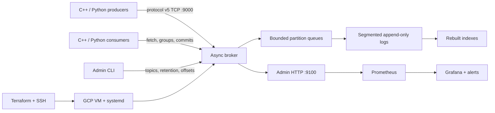

# BoltStream

[](https://github.com/fullstack-nick/BoltStream/actions/workflows/ci.yml)

BoltStream is a C++20 event-streaming broker built from first principles: a versioned
binary TCP protocol, asynchronous networking, partitioned append-only logs, consumer
groups, bounded backpressure, zstd batches, Prometheus observability, deterministic
recovery testing, and an exact-artifact GCP deployment.

It is deliberately smaller than Kafka and explicit about its boundaries. Replication is
an isolated leader/follower simulator—not consensus or automatic failover—and crash
testing proves recovery from torn tail writes, not physical power-loss durability.

## Architecture



The broker keeps the data path compact: Boost.Asio sessions validate frames and
correlation IDs, bounded queues serialize partition appends, CRC-protected segments
store records or compressed batches, and indexes are treated as rebuildable
accelerators. The admin listener remains loopback-only in the cloud deployment.

## What It Demonstrates

- C++20 with CMake/Ninja builds on Linux, MSVC, GCC, and Clang.
- A custom big-endian TCP protocol with CRC-checked headers, structured errors,
  authentication, capability negotiation, correlation IDs, and bounded frames.
- Durable multi-partition logs, segment rolling, retention, low watermarks, offset
  recovery, mixed uncompressed/zstd entries, and deterministic tail repair.
- Single and coordinated consumers with committed offsets, deterministic assignment,
  heartbeats, generation fencing, and long-poll fetch.
- Backpressure through bounded append queues, waiter limits, request limits, and
  retryable overload responses.
- Structured JSON logs, Prometheus metrics, Grafana provisioning, alert tests, health
  endpoints, build identity, and filesystem-capacity reporting.
- GoogleTest, ThreadSanitizer, cross-platform CI, reproducible packages, benchmark
  publication checks, Docker Compose, Terraform, SSH, and systemd operations.

## Five-Minute Docker Demo

Requirements: Docker Engine with Compose and PowerShell 7 (for the optional checks).

```powershell
git clone https://github.com/fullstack-nick/BoltStream.git
cd BoltStream
docker compose up --build -d
docker compose ps -a
curl.exe -fsS http://127.0.0.1:9100/health/ready
curl.exe -fsS http://127.0.0.1:9100/version
curl.exe -fsS http://127.0.0.1:9090/api/v1/query?query=boltstream_ready
curl.exe -fsS http://127.0.0.1:3000/api/health
```

Compose creates a topic, produces 25 records, consumes and commits 10, leaves visible
consumer lag, scrapes the broker with Prometheus, and provisions the `BoltStream
Operations` Grafana dashboard. Broker, admin, Prometheus, and Grafana ports bind only to
loopback. Open Grafana at `http://127.0.0.1:3000`, then clean up with:

```powershell
docker compose down -v
```

## Native Build and Test

The fastest Windows path uses the checked-in GCC preset. MSVC and Clang presets are
also available; Linux uses the equivalent `linux-gcc-debug` preset.

```powershell
.\scripts\toolchain-check.ps1
.\scripts\build.ps1 -Preset windows-gcc-debug
.\scripts\test.ps1 -Preset windows-gcc-debug
.\scripts\smoke-polish.ps1 -Preset windows-gcc-debug -SkipBuild
```

Run a broker manually:

```powershell
.\build\windows-gcc-debug\boltstream-server.exe `
  --config .\config\boltstream.example.yaml `
  --listen 127.0.0.1:9000 `
  --admin-listen 127.0.0.1:9100 `
  --data .\data
```

In another terminal, create a topic and exchange a record:

```powershell
.\build\windows-gcc-debug\boltstream-admin.exe topics create --topic trades --partitions 3
.\build\windows-gcc-debug\boltstream-producer.exe --topic trades --key AAPL --message "AAPL,100,192.41"
.\build\windows-gcc-debug\boltstream-consumer.exe --topic trades --partition 0 --from beginning
curl.exe -fsS http://127.0.0.1:9100/metrics
```

Use `curl.exe` in PowerShell because plain `curl` may be an alias. CLI commands emit
structured JSON with partitions, offsets, resume offsets, and retryability where
applicable.

## Python Interoperability

The reference client is a single Python 3 file with no third-party packages. It uses
the protocol-v4-compatible subset accepted by the v5 broker and validates frame size,
magic, version, flags, header CRC, correlation ID, response type, and payload length.

Against the Docker demo:

```powershell
$env:BOLTSTREAM_BROKER_TOKEN = "local-demo-token"
python .\clients\python\boltstream_client.py demo --topic python-demo
python -m unittest discover -s .\clients\python\tests -v
```

See the [Python client notes](clients/python/README.md) for its intentional scope.

## Metrics Example

`GET /metrics` returns Prometheus text format on the private admin listener. A healthy
broker exposes build identity and readiness alongside request, latency, queue, storage,
consumer-lag, retention, recovery, compression, replication-simulation, and filesystem
metrics. Representative samples are:

```text
boltstream_build_info{git_sha="<12-char-sha>",build_type="Release",protocol_version="5",storage_format_version="3"} 1
boltstream_ready 1
boltstream_records_produced_total 25
boltstream_consumer_lag_records{group="dashboard",topic="demo",partition="0"} 15
boltstream_storage_available_bytes 123456789
```

Prometheus rules and tests live under `deployments/metrics/`; Grafana provisioning is
under `deployments/grafana/`. The complete metric contract is documented in
[operations](docs/operations.md).

## Measured Performance

These are limited `e2-micro` results for commit `14d225abe1d5`, based on two complete
rounds for every profile and a third round for single-threaded and batched writes. They
show the effect of batching on this constrained VM; they are not general capacity
claims.

| Profile | Median records/s | Min | Max | CV | Median MiB/s | p50 (us) | p95 (us) | p99 (us) |
| --- | ---: | ---: | ---: | ---: | ---: | ---: | ---: | ---: |
| single-threaded | 104 | 71 | 125 | 27.13% | 0.031 | 258644.424 | 741374.534 | 753321.145 |
| worker-event-loops | 92 | 67 | 117 | 38.39% | 0.028 | 391006.978 | 746455.544 | 756699.619 |
| batched-writes | 180 | 171 | 191 | 5.46% | 0.054 | 12962.789 | 239372.586 | 243553.735 |

Reproduce a short local run, or execute the full controlled workload:

```powershell
.\scripts\bench.ps1 -Preset windows-msvc-release -Quick
.\scripts\bench.ps1 -Preset windows-msvc-release
```

Methodology, fetch results, raw-data locations, and publication rules are in the
[benchmark report](docs/benchmarks.md). Compression size evidence is documented
separately in [compression benchmarks](docs/compression-benchmarks.md).

## Crash Recovery Proof

`boltstream-recovery-proof` launches short-lived workers that flush three seed records,
inject a torn record, partial zstd batch, or stale/partial index mutation, and terminate
via `_Exit`. The parent requires an abnormal exit, reopens the partition, and verifies
exact records at offsets `0..2`, `next_offset=3`, log truncation where applicable, and a
canonical index rebuild.

```powershell
.\build\windows-gcc-debug\boltstream-recovery-proof.exe
```

This is process-crash and torn-tail evidence. It does not claim survival of unflushed
kernel page-cache data, controller loss, unrelated filesystem damage, or physical host
failure. Historical exact-artifact, CI, deployment, and live evidence remains under
[`proof/`](proof/).

## GCP Deployment

The checked-in cloud path intentionally favors control over abstraction:

1. Terraform provisions an Ubuntu VM, persistent data disk, Secret Manager access, and
   source-restricted firewall rules.
2. The deploy script installs an exact Git-SHA package under
   `/opt/boltstream/releases/<sha>` and moves the `current` symlink only after config
   validation.
3. systemd runs the broker as an unprivileged user with root-owned configuration;
   health, version, logs, storage files, and Terraform drift are checked after deploy.
4. The broker port is restricted to the operator CIDR. Admin and metrics stay on
   localhost and are reached through a guarded SSH tunnel.

Start with [the GCP runbook](docs/gcp.md). The repository's deployment helpers default
to the maintained project/account guard; a reviewer deploying a fork should replace
those checked-in defaults with their own account, project, billing account, state
bucket, and operator CIDR before running any mutating command.

## Documentation

- [Binary protocol](docs/protocol.md)
- [Storage format and recovery](docs/storage.md)
- [Administration](docs/admin.md)
- [Operations and metrics](docs/operations.md)
- [Benchmark methodology](docs/benchmarks.md)
- [GCP deployment](docs/gcp.md)
- [Python reference client](clients/python/README.md)

The authoritative engineering scope and compatibility decisions are kept in
[`PLAN.md`](PLAN.md); durable execution evidence is kept separately under [`proof/`](proof/).
